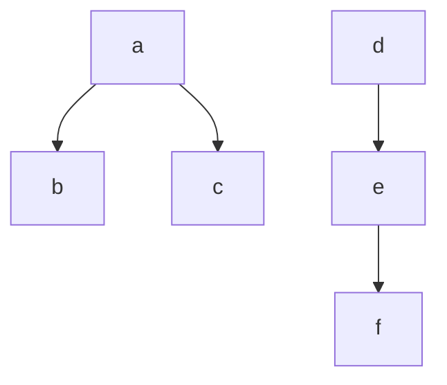

## Задание №5 

## Реализация структур данных «Граф» средствами языков программирования высокого уровня

### Задание

Реализовать структуру данных «Граф» и алгоритмы над данной структурой.
Программа должна быть выполнена в виде класса, соответствующего реализуемой структуре данных. Реализацию вести на C++.

Конструктор класса должен принимать на вход строку, описывающую структуру графа, вида:
```bash
a,b,c,d,e,f,ab,ca,de,ef
```
которая говорит о том что:
* граф состоит из шести вершин **a,b,c,d,e** и **f**. Для выполнения данного задания принимается ограничение на максимальное количество вершин равное 26.
* существуют ребра из **a** в **b**, из **a** в **c**, из **d** в **e** и из **e** в **f** при этом направление важно только для орграфа.



* Функция поиска должна возвращать последовательность вершин вида **"a,b,c,d,e,f"**
* Функция выделения компонент должна возвращать последовательность связных компонент вида **"abc,def"**.

Для возможности построения тестов производить лексикографическую сортировку вершин самих компонент и компонент между собой.

Номер варианта: (номер по журналу по модулю 8) + 1.

### Отчёт по заданию
Код, загруженный в личный репозиторий gitlabnto. Для сдачи задания необходимо:
1. Реализовать код по заданию.
2. Реализовать тесты к написанному коду с использованием Catch.
3. Ответить на теоретические вопросы по заданию.
4. Загрузить код в gitlabnto (каталог task4-5).

Каталог с проектом должен содержать файлы, названные строго заданным образом:
* task4-5/
    * task4-5.h
    * task4-5.cpp
    * tests4-5.cpp
    * main4-5.cpp (опциональный) 
    
**Обязательно** наличия комментария с заданием в начале файла с реализацией алгоритма.


Варианты:
1.	Граф неориентированный. Поиск (обход) в ширину с помощью матрицы смежности из заданной вершины.  Выделение связных компонент.

2.	Граф неориентированный. Поиск (обход) в ширину с помощью списка смежности из заданной вершины.  Выделение связных компонент.

3.	Граф неориентированный. Поиск (обход) в глубину с помощью матрицы смежности из заданной вершины.  Выделение связных компонент.

4.	Граф неориентированный. Поиск (обход) в глубину с помощью списка смежности из заданной вершины.  Выделение связных компонент.

5.	Граф ориентированный. Поиск (обход) в ширину с помощью матрицы смежности из заданной вершины.  Выделение сильно связных компонент.

6.	Граф ориентированный. Поиск (обход) в ширину с помощью списка смежности из заданной вершины.  Выделение сильно связных компонент.

7.	Граф ориентированный. Поиск (обход) в глубину с помощью матрицы смежности из заданной вершины. Выделение сильно связных компонент.

8.	Граф ориентированный. Поиск (обход) в глубину с помощью списка смежности.  Выделение сильно связных компонент.	

## Примеры тестов

Необходимо подготовить тестовые данные содержащие одну/несколько связных (сильносвязных) компонент.

Осуществлять поиск из разных вершин


[Задание 1](task4-1.md) [Задание 2](task4-2.md) [Задание 3](task4-3.md) [Задание 4](task4-4.md) [Задание 6](task4-6.md)
