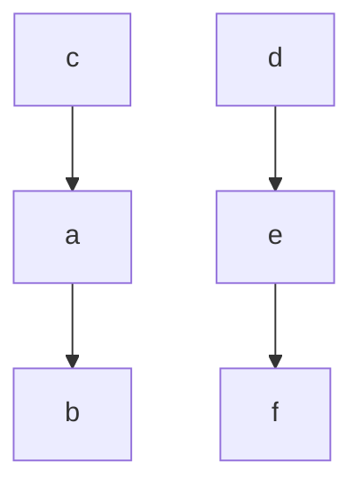

## Задание №6 

## Реализация алгоритмов над структурой данных «Граф» средствами языков программирования высокого уровня.

### Задание 
Реализовать алгоритмы над структурой данных «Граф».
Программа должна быть выполнена в виде класса, соответствующего реализуемой структуре данных. Реализацию вести на C++.
Конструктор класса должен принимать на вход строку, описывающую структуру графа, вида:
```bash
a,b,c,d,e,f,ab10,ca20,de30,ef10
```
которая говорит о том что:
* граф состоит из шести вершин **a,b,c,d,e** и **f**. Для выполнения данного задания принимается ограничение на максимальное количество вершин равное 26.
* существуют ребра из **a** в **b** весом 10, из **c** в **a** весом 20, из **d** в **e** весом 30 и из **e** в **f** весом 10 при этом направление важно только для орграфа.



* Функция нахождения минимального остовного дерева должна находить остовное дерево представленное в виде последовательности ребер отсортированных по алфавиту вида **"ab,ac,de,ef"** и вес оставного дерева, которые нужно хранить в переменных класса.
* Функция нахождения кратчайшего пути должна принимать на вход стартовую вершину и находить путь представленный в виде последовательности ребер, а также длину пути, которые нужно хранить в переменных класса.
* Функция нахождения максимального потока должна приримать на вход вершины. Результат также хранить в переменных класса.

Номер варианта: (номер по журналу по модулю 8) + 1.

### Отчёт по заданию
Код, загруженный в личный репозиторий gitlabnto. Для сдачи задания необходимо:
1. Реализовать код по заданию.
2. Реализовать тесты к написанному коду с использованием Catch.
3. Ответить на теоретические вопросы по заданию.
4. Загрузить код в gitlabnto (каталог task4-6).

Каталог с проектом должен содержать файлы, названные строго заданным образом:
* task4-6/
    * task4-6.h
    * task4-6.cpp
    * tests4-6.cpp
    * main4-6.cpp (опциональный) 
**Обязательно** наличия комментария с заданием в начале файла с реализацией алгоритма.

Варианты:
1.	Построение минимального остовного дерева. Алгоритм Крускала.

2.	Построение минимального остовного дерева. Алгоритм Прима.

3.	Нахождение кратчайших путей от одной до остальных вершин в графе без ребер отрицательного веса. Алгоритм Дейкстры. Граф представлен в памяти в виде матрицы смежности.

4.	Нахождение кратчайших путей от одной до остальных вершин в графе без ребер отрицательного веса. Алгоритм Дейкстры. Граф представлен в памяти в виде списков смежности.

5.	Нахождение кратчайших путей от одной вершины до всех остальных. Алгоритм нахождения кратчайших путей в ориентированном ациклическом графе (на основе топологической сортировки).

6.	Нахождение критических путей от одной вершины до всех остальных. Алгоритм нахождения критических путей в ориентированном ациклическом графе (на основе топологической сортировки).

7.	Нахождение кратчайших путей от одной вершины до всех остальных в взвешенных графах. Алгоритм Беллмана-Форда.

8.	Нахождение максимального потока в ориентированном взвешенном графе. Алгоритм Форда-Фалкерсона.

[Задание 1](task4-1.md) [Задание 2](task4-2.md) [Задание 3](task4-3.md) [Задание 4](task4-4.md) [Задание 5](task4-5.md)
